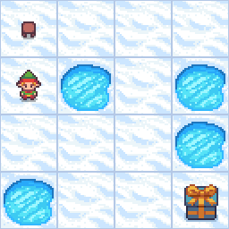

# FrozenLake ❄️🕹️☃️
 
This project implements a Deep Q-Learning (DQN) agent to solve the FrozenLake environment from OpenAI's Gym. The agent uses a neural network to approximate the Q-value function and employs experience replay to learn from past experiences.


## Table of Contents

- [FrozenLake ❄️🕹️☃️](#frozenlake-️️️)
  - [Table of Contents](#table-of-contents)
  - [Demo](#demo)
  - [Features](#features)
  - [Installation](#installation)
  - [Usage](#usage)
  - [Results](#results)
    - [Loss per Step](#loss-per-step)
    - [Rewards per Episode](#rewards-per-episode)
  
## Demo


## Features

- **Environment**: FrozenLake-v1 with slippery tiles.
- **Neural Network**: A simple feed-forward neural network with two hidden layers.
- **Experience Replay**: Stores experiences and samples random batches for training.
- **Epsilon-Greedy Policy**: Balances exploration and exploitation.
- **GIF Generation**: Saves a GIF of the agent's performance for each episode.
- **Performance Tracking**: Plots the loss per step and rewards per episode.

## Installation

To run this project, you need Python and the following libraries:

- gym
- numpy
- tensorflow
- matplotlib
- imageio

Install the required packages using pip:

```bash
pip install gym numpy tensorflow matplotlib imageio
```

## Usage

1. **Initialize the Environment**: Set up the FrozenLake environment with slippery tiles.
2. **Define Q-Learning Parameters**: Set parameters like learning rate, discount factor, exploration-exploitation parameters, number of episodes, and batch size.
3. **Create Neural Network Model**: Build a feed-forward neural network with TensorFlow to approximate Q-values.
4. **Implement Epsilon-Greedy Policy**: Use an epsilon-greedy policy for action selection to balance exploration and exploitation.
5. **Set Up Replay Buffer**: Store experiences in a replay buffer and sample random batches for training.
6. **Train the Agent**: Train the agent using the Q-learning algorithm, updating the target model periodically.
7. **Save GIFs**: Record and save a GIF of the agent's performance for each episode.
8. **Save the Model**: Save the trained model for future use.
9. **Plot Performance**: Plot the loss per step and rewards per episode to evaluate the agent's performance.
10. **Test the Agent**: Run the trained agent in the environment to observe its behavior.

## Results

### Loss per Step


### Rewards per Episode

